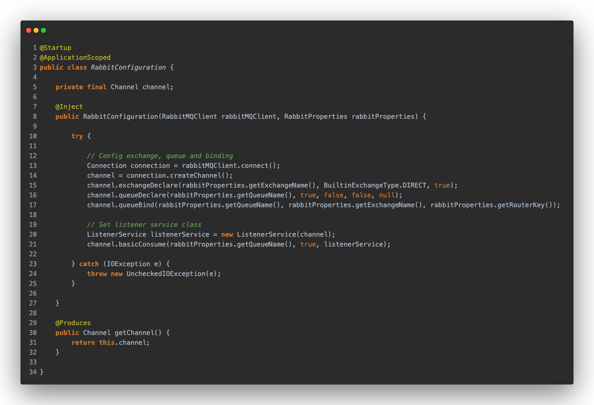
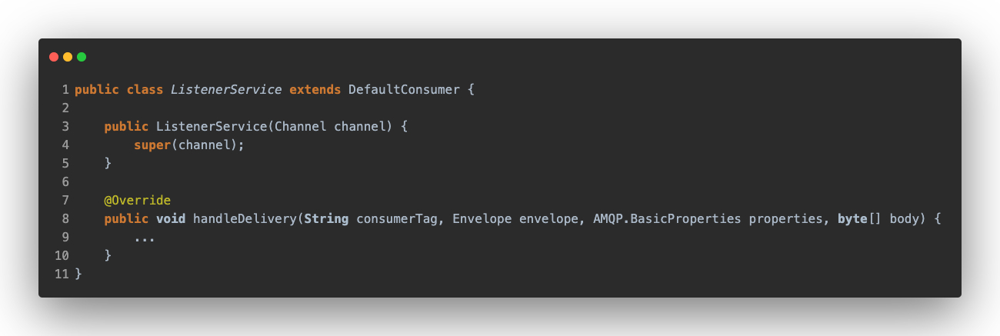
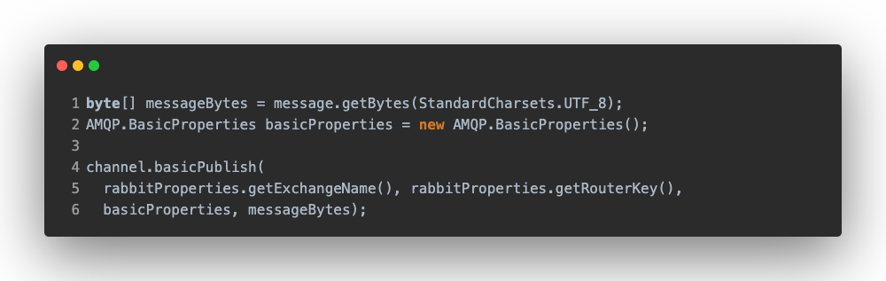
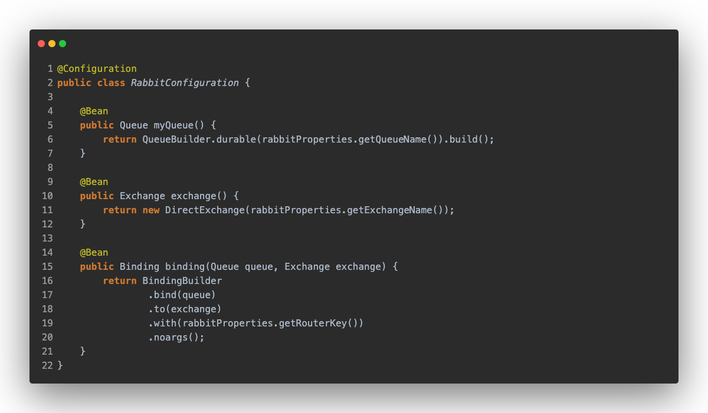
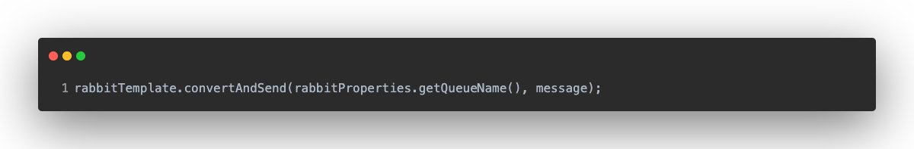
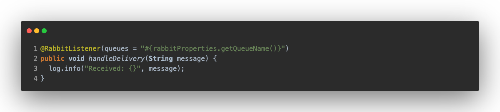

# Imperative AMQP

In this section, we are going to compare how the different are between Spring and Quarkus using RabbitMQ.

# Quarkus
In this case, the Maven dependency used is [quarkus-rabbitmq-client](https://github.com/quarkiverse/quarkus-rabbitmq-client) belongs to "Quarkus Universe", that is, someone from the Quarkus community has created it, and it hasn't been created by the Quarkus core development team.

But why don't we use the "official" dependency? because the official one is based on reactive implementation.

First of all is the connection to RabbitMQ, which is configured through the application.properties.

Next, it's to configure the queues, exchanges and bindings, unlike Spring, it's required to get the RabbitMQ connection and create a channel, and declare the queues, exchanges and bindings inside the channel.

Now, we must instantiate our _Listener_ by passing the channel created earlier, the _Listener_ must inherit from _DefaultConsumer_. Then, we declare a consumer in the channel that will be the _Listener_, in charge of handling and receiving the messages.

> We have approached this implementation of the Listener as if we were using Spring, which is to have a class with a method where messages are handled.

Finally, the _channel_ is declared as a Bean using _@Produces_.

As a particularity, this configuration class is annotated with _@ApplicationScoped_ because there is no _@Configuration_ as in Spring, and also with _@Startup_, because Quarkus doesn't have an "Application" class with a "main" method, so we indicate that it must be started at startup.

_And, how can we send a message?_ here, you have to use the _channel_ to publish, indicating where and how you want to send the message, and we have to send it as an bytes array.

## Spring
The application relies on [Spring AMQP](https://spring.io/projects/spring-amqp), making integration very easy. The connection is configured through the application.propeties and it is only necessary to create a configuration class where we declare the queues, exchanges and bindings through Beans.

Then using _RabbitTemplate_ indicate what you want to send and to where:

Finally, to consume the messages, we will have to have a method annotated with _@RabbitListener_ indicating the queue

## Conclusion

As you can see, the best option is to use Spring, as it makes it really easy and fast to configure. It is true that doing it with Quarkus is not more difficult, but it requires more configuration by the developer and as a negative point the library is not the official one.