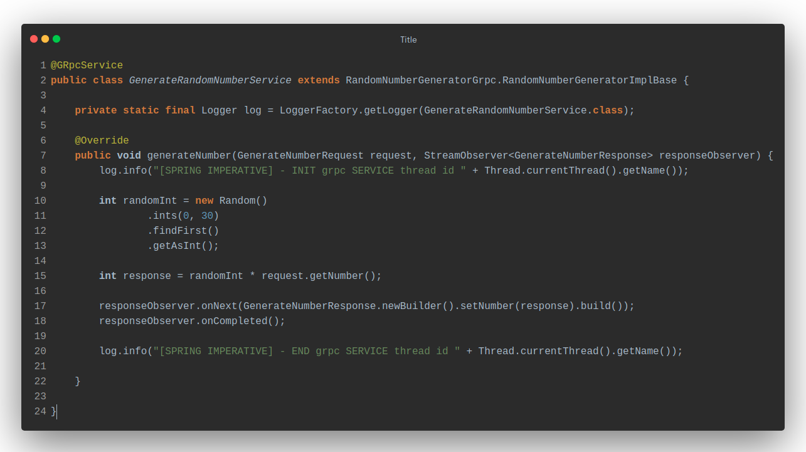

# gRPC

In this comparison we will look at the main differences between Quarkus and Spring when implementing gRPC servers that do not require reactive behaviour.

Both implementations multiply the number received in the request by a randomly generated number between 0 and 30.

## gRPC Service
The main difference is where the `GrpcService` class comes from, in `Quarkus` it comes from `io.quarkus.grpc.GrpcService` while spring brings it in the [Spring Boot gRPC Starter](https://github.com/LogNet/grpc-spring-boot-starter).

The `generator.proto` file is the same in both cases, in the build phase it will be in charge of generating the necessary classes that will be used in the implementation of the service.

## gRPC Service implementation

The implementation of the service in both cases is the same with a small peculiarity in the case of Quarkus.

## Quarkus

Quarkus works in a reactive way by default when creating gRPC servers, for a non-reactive use case it is necessary to add the `@Blocking` annotation in our service method, which comes from `io.smallrye.common.annotation.Blocking`.

## Spring

In `Spring`, as we can see, there is no apparent difference with respect to `Quarkus` other than the application startup class and not having a reactive behavior by default.

## Conclusion
In this case, we can observe that there are no notable differences in the implementation of a non-reactive gRPC server between Quarkus and Spring beyond the default reactive behavior of Quarkus. Any of the two frameworks is a more than correct option.