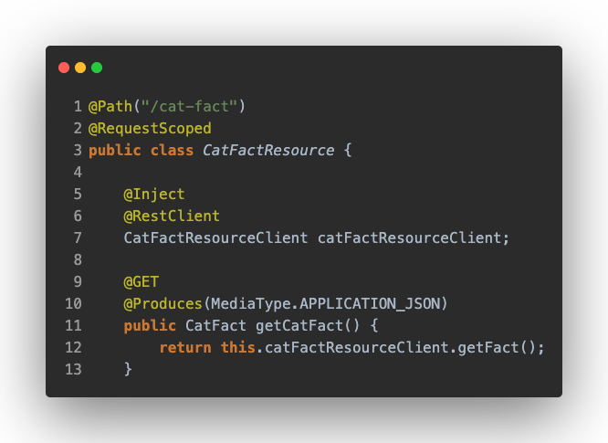
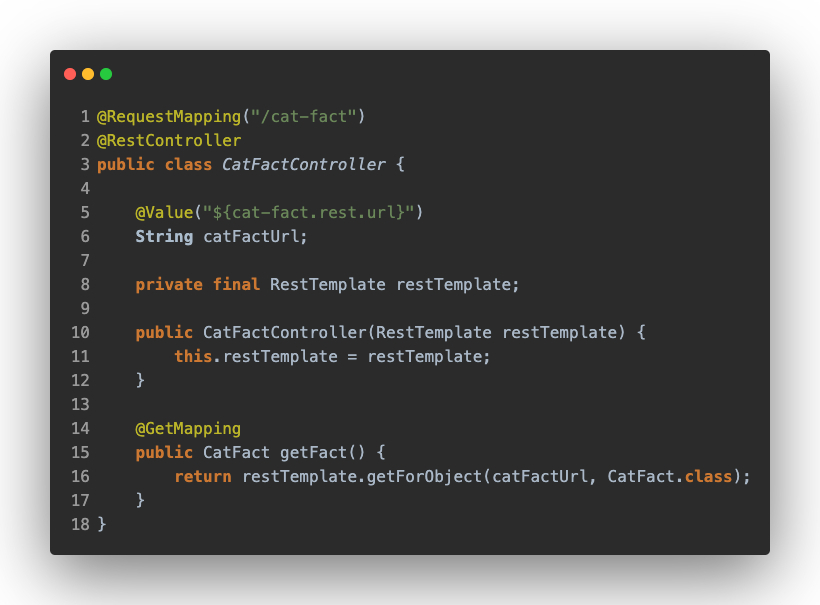
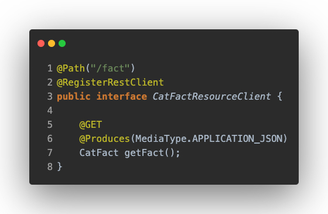
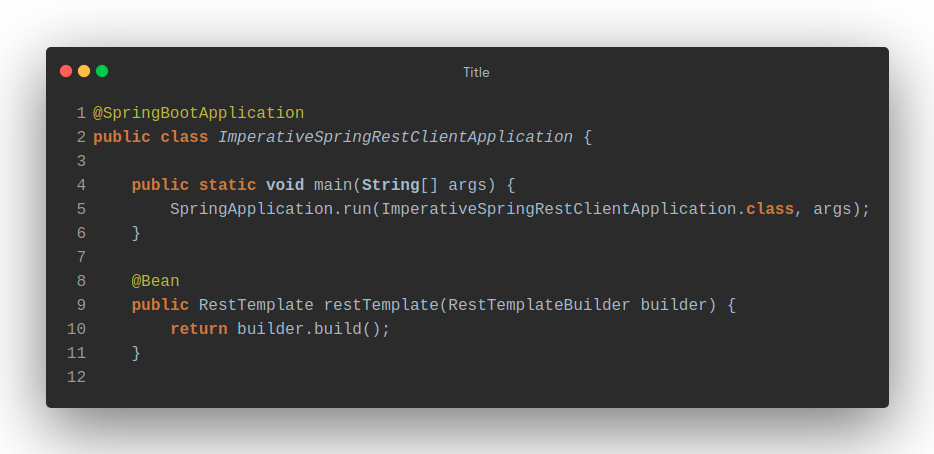

# REST to REST

In this comparison we will look at the main differences between Quarkus and Spring when implementing rest clients that do not require reactive behaviour.

Both implementations make a call to a public cat fact API to retrieve a random cat fact.

Public cat fact API: https://catfact.ninja/

## Controller Layer
The main differences are in the dependencies, Quarkus uses [RESTEasy](https://resteasy.dev/) implementation of the JAX-RS specification, while Spring uses the [Spring MVC](https://docs.spring.io/spring-framework/docs/5.3.15/reference/html/web.html#mvc) module.

There are also differences at the semantic level, Spring calls this layer as Controllers, and Quarkus calls it as Resources.

Quarkus makes use of `JAX-RS` annotations

While Spring requires using `@RestController`, `@GetMapping`, etc...

## Rest client implementation

There are many HTTP Client libraries like [Apache HttpComponents](https://hc.apache.org/) or [OkHttp](https://square.github.io/okhttp/), but let's see the differences between [Microprofile](https://microprofile.io/), which has built-in support in Quarkus and [RestTemplate](https://docs.spring.io/spring-framework/docs/current/javadoc-api/org/springframework/web/client/RestTemplate.html) for Spring.

## Quarkus
### Microprofile

In Quarkus is as simple as creating an interface using the `JAX-RS` and `MicroProfile` annotations.
In this case the interface has the following content:

We can observe different annotations in this code snippet:

`@RegisterRestClient`: lets Quarkus know that this interface has to be available for the [CDI](https://quarkus.io/guides/cdi-reference) as a REST Client.

`@Path, @GET and @PathParam`: are the basic JAX-RS annotations, which are used to define how your service will be accessed.

In order to know which is going to be the base url that your client is going to call and which is going to be its scope, the following configuration is applied

`es.urjc.CatFactResourceClient/mp-rest/url=https://catfact.ninja`

- Means that all requests performed using `CatFactResourceClient` will use https://catfact.ninja as the base URL.

`es.urjc.CatFactResourceClient/mp-rest/scope=javax.inject.Singleton`

- Means that the default scope of `CatFactResourceClient` will be `@Singleton`.

Note that `es.urjc.CatFactResourceClient` must match the fully qualified name of the `CatFactResourceClient` interface we created previously.

In order to use our rest client, we are going to need to inject it into the component that is going to use it, a **resource** (Spring controller) that is going to make a GET call to get a random fact about cats.

As you can see, in addition to including the standard CDI `@Inject` annotation, we will also need to use the annotation provided by MicroProfile `@RestClient` to inject our `CatFactResourceClient`.

## Spring
### RestTemplate

In Spring, on the other hand, we will need to initialize a `RestTemplate` bean, which we will be able to inject in the place where we need to make our external call.
In this case, our bean is inside the application start class, a separate configuration class could be created if necessary.

At property level, we will have the following one, which will indicate, as in Quarkus, which is going to be the value of our base url to which the call will be made

`cat-fact.rest.url=https://catfact.ninja/fact`

- Means that all requests performed using `RestTemplate` will use https://catfact.ninja as the base URL, as long as we use this value for our calls.

As we can see, in our controller, it would be as simple as injecting our `RestTemplate` component, and, through a `.getForObject()`, pass as a parameter the base url next to the object that will serve to map the response.

## Conclusion
In this case, although both solutions are easy to implement, Spring may win the game by a small difference of points, since it would be as simple as creating a new Bean and use it wherever we want, being able to parameterize it with the base url that is necessary in each case only by including a new property.