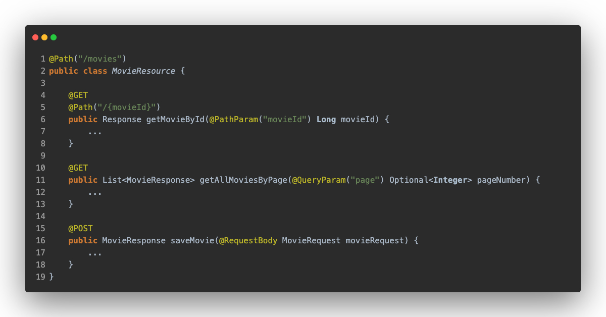
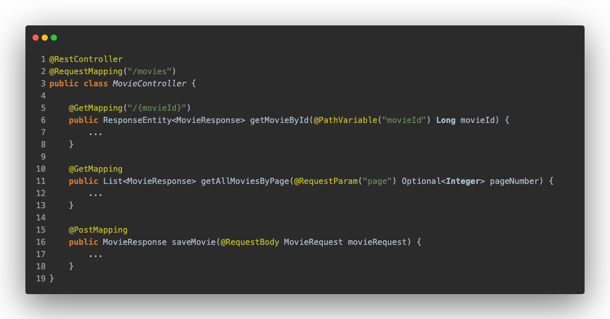
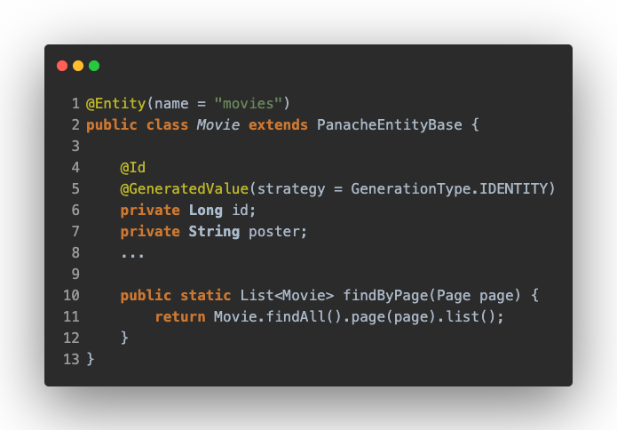
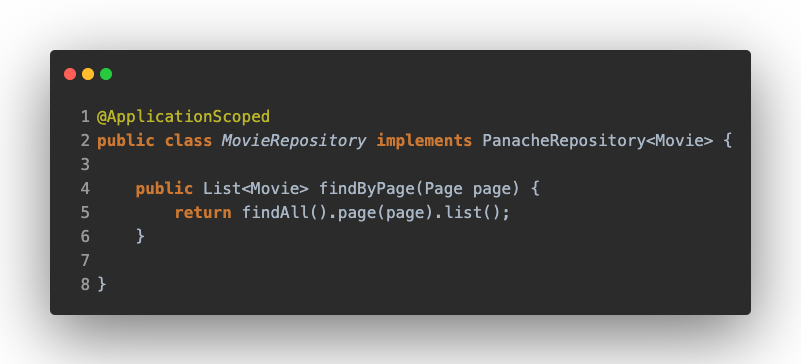
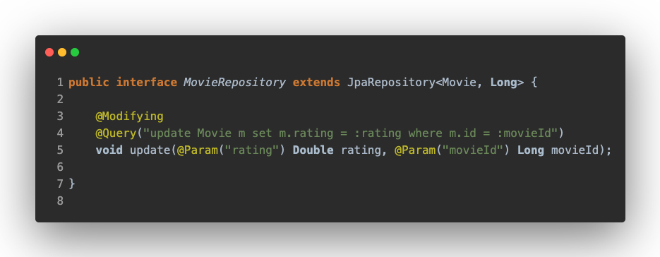

# REST to DB

In this section, we are going to see the differences between Spring and Quarkus in the controller and persistence layer, but the main difference is that Quarkus does not require an Application class with a main method as Spring does.

## Controller Layer
The main differences are in the dependencies, Quarkus uses [RESTEasy](https://resteasy.dev/) implementation of the JAX-RS specification, while Spring uses the [Spring MVC](https://docs.spring.io/spring-framework/docs/5.3.15/reference/html/web.html#mvc) module.

There are also differences at the semantic level, Spring calls this layer as Controllers, and Quarkus calls it as Resources.

Quarkus makes use of JAX-RS annotations 

While Spring requires using @RestController, @GetController, etc...

## Persistence Layer

In this layer, Quarkus offers two possibilities: [Panache](https://quarkus.io/guides/hibernate-orm-panache) and Spring Data JPA for Quarkus. But Spring offers [Spring Data JPA](https://spring.io/projects/spring-data).

## Quarkus
### Panache

Quarkus has Panache for database connection, it's a library similar to Spring Data JPA, simplifying the most common database operations.

Mention Panache has two difference implementations, the active record pattern and the repository pattern

#### _Active Record Pattern_

This pattern delegates all database operations in the entity. Martin Fowler describes it in an [article](https://www.martinfowler.com/eaaCatalog/activeRecord.html) as:

> An object that wraps a row in a database table or view, encapsulates the database access, and adds domain logic on that data.

As you can see, the entity extends from _PanacheEntityBase_, which contains all the operations, you can also add your own new operations like _findByPage_.

#### _Repository Pattern_

In this pattern, all database operations are contented in repository layer, it's so common to see this in Spring Data JPA.

In this case, there is a class that implements the _PanacheRepository_ interface, which contains the database operations as with Spring Data JPA.

#### _Spring Data JPA For Quarkus_

Quarkus supports differents Spring dependencies, Spring Data JPA is one of [them](https://quarkus.io/guides/spring-data-jpa#more-spring-guides), it works in the same way as if you would use with Spring Framework.

If you have worked with Spring Data JPA before, it is clear that it is used in the same way as if you were in the Spring Framework ecosystem.

## Spring
How it's well known, Spring uses the [Spring Data JPA](https://spring.io/projects/spring-data) dependency for connect to ORM databases together the respository pattern.

If we look at the image above, we can see that there is no difference in using this dependency.