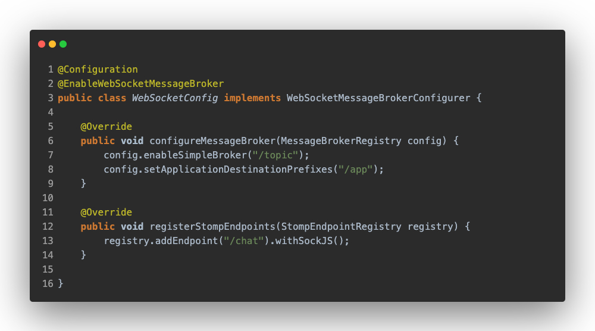

# WebSockets

Here, we are going to see how different Quarkus solution is compared to Spring.

## Quarkus

Quarkus has a specific library which is _quarkus-websockets_ that makes it very easy to develop a WebSocket server.

We just need to declare what the endpoint is, as if it were a REST resource, the client side will just connect to that endpoint. Then, we can see that through the different annotations it allows us to handle the events related to the client websocket.

## Spring

Here, we are using [STOMP](https://stomp.github.io/stomp-specification-1.2.html#Abstract) and [SockJS](https://github.com/sockjs/sockjs-client) as well, the reason for this is because Spring "recommends" to use this configuration instead of using the raw WebSocket API. This particular configuration does more dificult to undestand but at the same time gives more powerful.

A quick resume:
* **STOMP (Simple Text Oriented Messaging Protocol)**: is a text-oriented protocol that provides headers and body, and works as messaging brokers. This is useful because the clients can subscribe to any topic.
* **SockJS**: tries to use native WebSockets, and only if it can't it tries to use another substitute protocol.

## Server Side
First, we see that we have to have a configuration class that inherits from _WebSocketMessageBrokerConfigurer_ and we have to annotate it with _@EnableWebSocketMessageBroker_.

Note that we enable the STOMP broker and indicate that the messages received by the server must have an `/app` prefix. In addition, we register in STOMP an endpoint `/chat` that will go over SockJS, this will be the point where the client side should connect.

Now, in the class that contains the logic to handle WebSocket operations is more familiar, this class is annotated with _@Controller_ and the methods have _@MessageMapping_ which is where the messages will be received from and _@SendTo_ where the messages will be sent to the clients that are subscribed to the topic.

## Client Side

First, we instantiate a SockJS object indicating the `/chat` endpoint, this endpoint is where it will connect to the WebSocket as we have already seen. Next, the SockJS object is used to create a STOMP object, it will realize the "WebSocket" operations, including connecting to the server's broker.

We can also see how it sends messages to the endpoints declared in the server, and that it is subscribed to the message topic.

## Conclusion

Spring's solution is more complicated and probably very useful in certain cases, but if you want to use WebSockets in a traditional way, it isn't the best alternative. However, Quarkus allows a clean and simple implementation.