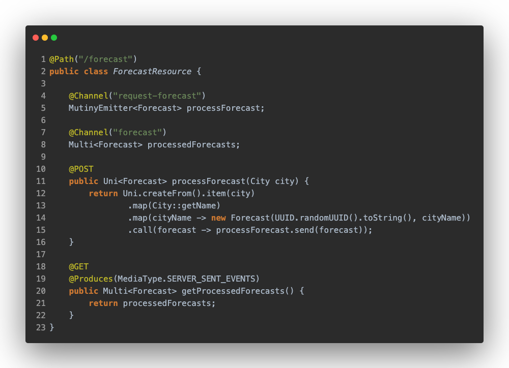
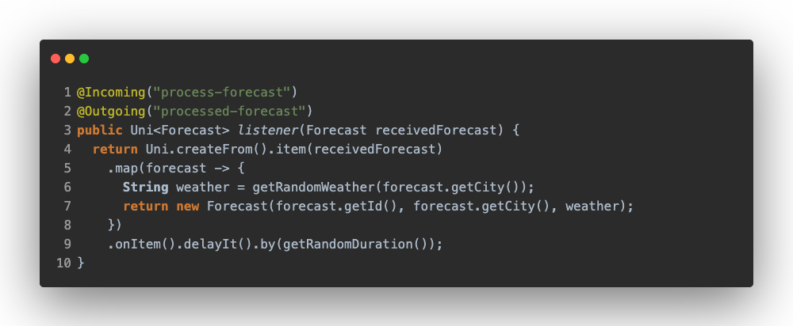
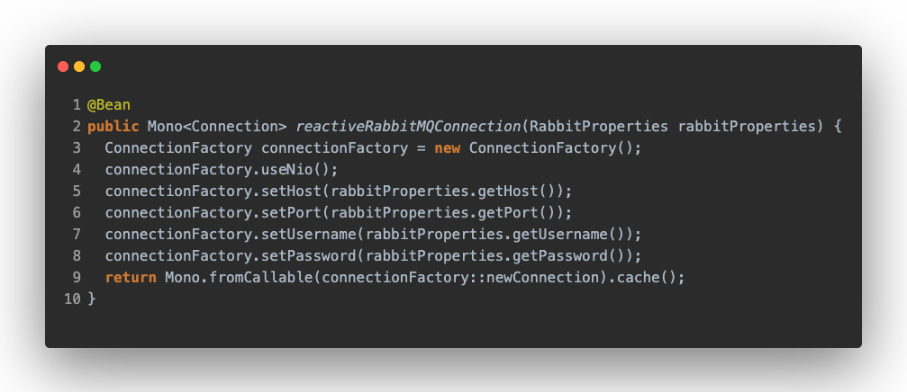
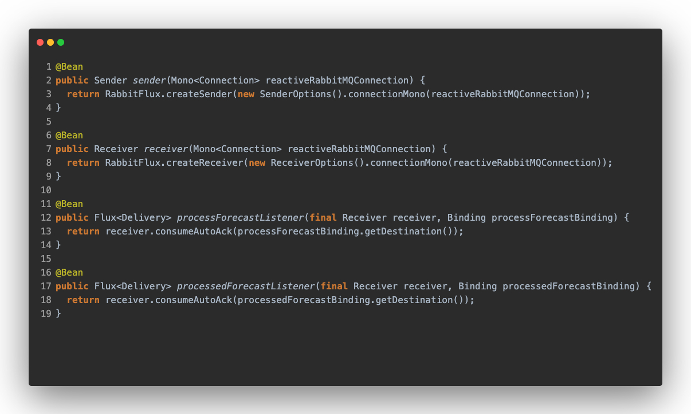
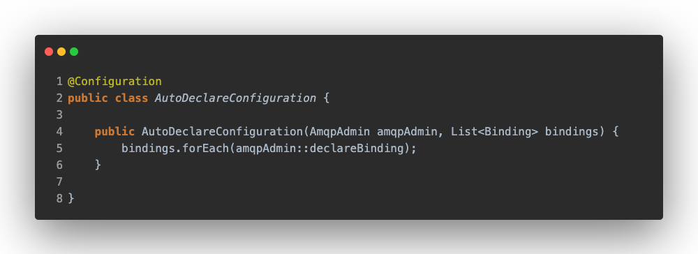

# Reactive AMQP

In this section, we are going to compare different approaches of both Frameworks. Before we start, the first and most obvious difference is in the reactive part. Spring makes use of [Spring Webflux](https://docs.spring.io/spring-framework/docs/current/reference/html/web-reactive.html#webflux), which internally uses the Reactor library based on the [Project Reactor](https://projectreactor.io/), thus using the Mono and Flux types. Quarkus on the other hand relies on [Mutiny](https://smallrye.io/smallrye-mutiny/), using Mono and Multi types.

## Quarkus

To make this application we use [Smallrye Reactive Messaging](https://smallrye.io/smallrye-reactive-messaging/smallrye-reactive-messaging/3.13/index.html) library, making use of [Reactive Streams](https://www.reactive-streams.org/). 

To start with, it is necessary to define in the _application.properties_ the data flow, indicating the input/output direction of the data and assigning a name to the channel. Inside this channel the exchange and the queue are defined.

```properties
mp.messaging.incoming.[channel-name].exchange.name=exchange-name
mp.messaging.incoming.[channel-name].queue.name=queue-name

mp.messaging.outgoing.[channel-name].exchange.name=exchange-name
mp.messaging.outgoing.[channel-name].queue.name=queue-name
```

If we go to the code, we can see how we make use of the channels defined in the properties to receive and send messages.



Also, in this other code we have the _@Incoming/@Outcoming_ annotations on the method, in this simple way, we say from which channel we are going to consume and to which channel we are going to send the output.



## Spring

On the Spring side, it still relies on [Spring AMQP](https://spring.io/projects/spring-amqp) and also requires the [Reactor RabbitMQ](https://projectreactor.io/docs/rabbitmq/snapshot/reference/) library to provide the reactive behaviour. So we need to configure the RabbitMQ connection and make it reactive. 



In addition, we have a `sender` and `receiver` Beans to send and receive messages, and two other Beans `processForestListener` and `processedForestListener` which will be the listeners.



And as in the imperative part, we must create the queue, exchange and bindings, but here we are responsible for declaring these element pieces.



## Conclusion

Spring's Reactive configuration for AMQP gets complicated, it isn't as simple as the imperative part and it's a bit less user friendly, it requires more configuration and its approach isn't quite uniform compared to its imperative side. Quarkus, on the other hand, has a clean, simple and more readable approach.
