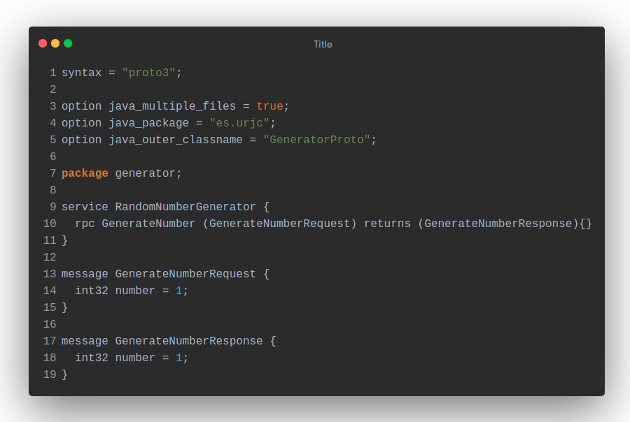
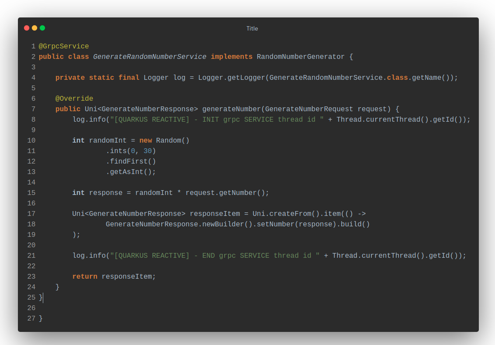
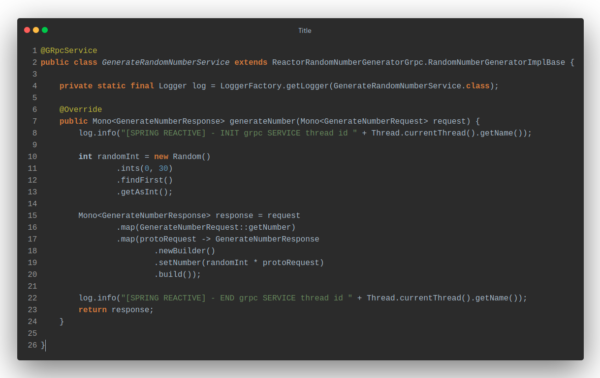

# Reactive gRPC

In this comparison we will look at the main differences between Quarkus and Spring when implementing gRPC servers that do require reactive behaviour.

Both implementations multiply the number received in the request by a randomly generated number between 0 and 30.

## gRPC Service
As in our imperative comparison, the `GrpcService` class in `Quarkus` it comes from `io.quarkus.grpc.GrpcService` while spring brings it in the [Spring Boot gRPC Starter](https://github.com/LogNet/grpc-spring-boot-starter).

Although in this case, the most important difference between the reactive approach of a gRPC server implementation in Quarkus and Spring is the use of the object that wraps the response of our call, in the case of Quarkus, [Mutiny](https://quarkus.io/guides/getting-started-reactive) will provide us with the object `io.smallrye.mutiny.Uni`, while in Spring, [Reactor](https://projectreactor.io/docs/core/release/reference/) will do practically the same with `reactor.core.publisher.Mono`.

The `generator.proto` file is the same in both cases, in the build phase it will be in charge of generating the necessary classes that will be used in the implementation of the service.

## gRPC Service implementation

The implementation of the service in both cases is the same, only the object with which the response is wrapped changes.

## Quarkus

As we can see, `io.smallrye.mutiny.Uni` is used in this case to return the response.

## Spring

As we can see, `reactor.core.publisher.Mono` is used in this case to return the response.

## Conclusion
It can be seen that there are no notable differences in the implementation of both solutions other than the use of `io.smallrye.mutiny.Uni` provided by Mutiny versus the use of reactor.core.publisher.Mono` supported by Spring Reactor. Any of the two frameworks is a more than correct option.