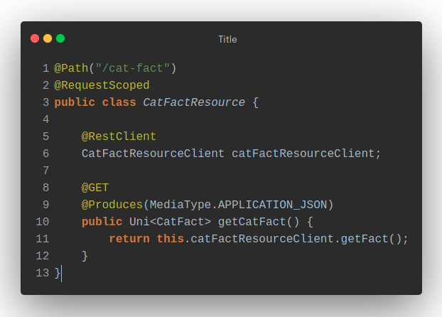
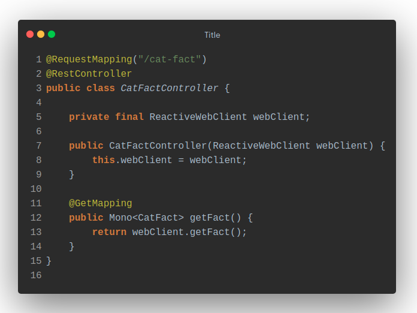
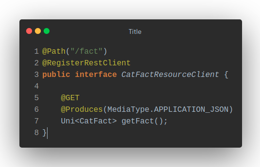
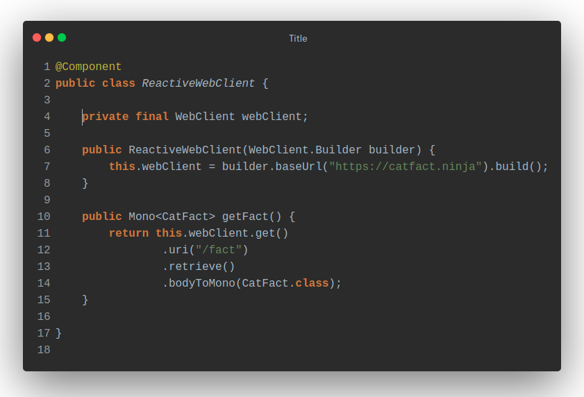
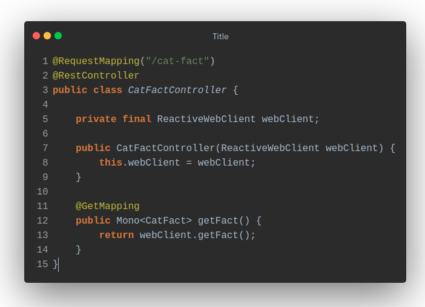

# Reactive REST to REST

In this comparison we will look at the main differences between Quarkus and Spring when implementing rest clients that do require reactive behaviour.

Both implementations make a call to a public cat fact API to retrieve a random cat fact.

Public cat fact API: https://catfact.ninja/

## Controller Layer
The main differences are in the dependencies, Quarkus uses [RESTEasy](https://resteasy.dev/) implementation of the JAX-RS specification, while Spring uses the [Spring MVC](https://docs.spring.io/spring-framework/docs/5.3.15/reference/html/web.html#mvc) module.

There are also differences at the semantic level, Spring calls this layer as Controllers, and Quarkus calls it as Resources.

Quarkus makes use of `JAX-RS` annotations, as well as producing `io.smallrye.mutiny.Uni` on the response.

While Spring requires using `@RestController`, `@GetMapping`, etc, as well as producing `reactor.core.publisher.Mono` on the response.

## Rest client implementation

Let's see the differences between [Microprofile](https://microprofile.io/), which has built-in reactive support in Quarkus and [WebClient](https://docs.spring.io/spring-framework/docs/current/reference/html/web-reactive.html) for Spring.

## Quarkus
### Microprofile

In Quarkus is as simple as creating an interface using the `JAX-RS` and `MicroProfile` annotations.
In this case the interface has the following content:

We can observe different annotations in this code snippet:

`@RegisterRestClient`: lets Quarkus know that this interface has to be available for the [CDI](https://quarkus.io/guides/cdi-reference) as a REST Client.

`@Path, @GET and @PathParam`: are the basic JAX-RS annotations, which are used to define how your service will be accessed.

`io.smallrye.mutiny.Uni`: It is the reactive wrapper for our client response.

In order to know which is going to be the base url that your client is going to call and which is going to be its scope, the following configuration is applied

`es.urjc.CatFactResourceClient/mp-rest/url=https://catfact.ninja`

- Means that all requests performed using `CatFactResourceClient` will use https://catfact.ninja as the base URL.

`es.urjc.CatFactResourceClient/mp-rest/scope=javax.inject.Singleton`

- Means that the default scope of `CatFactResourceClient` will be `@Singleton`.

Note that `es.urjc.CatFactResourceClient` must match the fully qualified name of the `CatFactResourceClient` interface we created previously.

## Spring
### WebClient

The Spring reactive case changes a little bit with respect to the imperative case, in this case we will no longer use `RestTemplate`, but we will create a class annotated as `@Component` where we will have the logic of our external call, as we can see below:

This `ReactiveWebClient` returns a `reactor.core.publisher.Mono` object, which will also be used from our controller

## Conclusion
In this use case, both implementations are equally correct since we dispense with the use of `RestTemplate`, which is replaced by a reactive version of `WebClient`, similar to what Quarkus does.