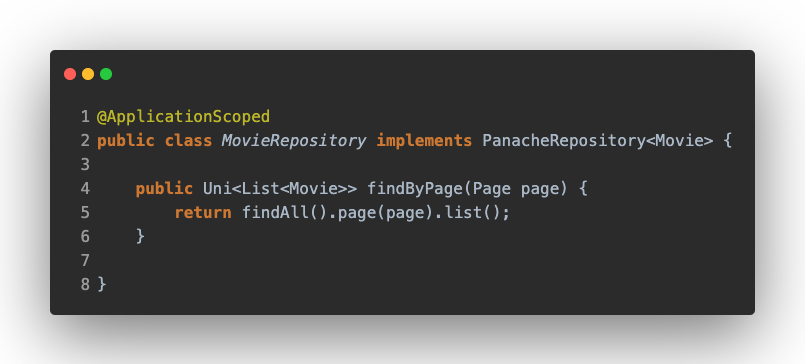

# REST to DB

In this section, we are going to see the differences between Spring and Quarkus in the controller and persistence layer. The main difference is the reactive part. Spring makes use of [Spring Webflux](https://docs.spring.io/spring-framework/docs/current/reference/html/web-reactive.html#webflux), which internally uses the Reactor library based on the [Project Reactor](https://projectreactor.io/), thus using the Mono and Flux types. Quarkus on the other hand relies on [Mutiny](https://smallrye.io/smallrye-mutiny/), using Mono and Multi types.

## Controller Layer

The main differences are in the dependencies, Quarkus uses [Reactive RESTEasy](https://resteasy.dev/2020/12/07/resteasy-reactive/) implementation of the JAX-RS specification, while Spring uses the [Spring Webflux](https://docs.spring.io/spring-framework/docs/current/reference/html/web-reactive.html#webflux) module.

If we look at the code, we can see that the annotations don't change with respect to the imperative paradigm, but the rest of the code has changed due to the reactive paradigm. 

Quarkus, thanks to Mutiny, makes it easier to implement the logic because of its API, which is event-driven and designed to handle those events, making it easier to know which method to use after an event. 

On the Spring Webflux side, the approach is event-driven as well, but its API is designed to make use of declarative code via operators and transformers, making it more time-consuming to learn.

## Persistence Layer

In this layer, Quarkus only offers [Hibernate Reactive with Panache](https://quarkus.io/guides/hibernate-reactive-panache), Spring Data JPA for Quarkus is currently [unsupported](https://quarkus.io/guides/spring-data-jpa#what-is-currently-unsupported).

## Quarkus
### Hibernate Reactive with Panache

Quarkus sigue usando Panache para facilitar y abstraer de las operaciones y las conexiones a base de datos al igual que la parte reactiva, la unica diferencia es que por debajo usa una implementacion reactiva de hibernate.

Mention Panache has two difference implementations, the active record pattern and the repository pattern

#### _Active Record Pattern_

This pattern delegates all database operations in the entity. Martin Fowler describes it in an [article](https://www.martinfowler.com/eaaCatalog/activeRecord.html) as:

> An object that wraps a row in a database table or view, encapsulates the database access, and adds domain logic on that data.

As you can see, the entity extends from _PanacheEntityBase_, it's the same class as in the imperative part, but it refers to the reactive package. The operations remain the same but return `Uni` or `Multi` objects, you can also add your own new operations like _findByPage_ wraps in reactive class type.

#### _Repository Pattern_

In this pattern, all database operations are contented in repository layer. In this case, there is a class that implements the _PanacheRepository_ interface, it's the same class as in the imperative part, but it refers to the reactive package. The operations remain the same but return `Uni` or `Multi` objects,

You would have noticed that there is an _@ApplicationScoped_ annotation, this is equivalent to the _@Component_ annotation in Spring.

## Spring
For the reactive part, Spring replaces [Spring Data JPA](https://spring.io/projects/spring-data) for the [Spring Data R2DBC](https://docs.spring.io/spring-framework/docs/current/reference/html/data-access.html#r2dbc) dependency for reactive connection. Another difference is the repository, where it makes use of _ReactiveCrudRepository_ and the objects it returns are of type `Mono` or `Flux`.

Furthermore, unfortunately, the Data Access with R2DBC does not support JPQL and it is necessary to write simple SQL queries.

## Conclusion
Both frameworks continue to offer very good solutions, and although the reactive approach Quarkus doesn't support the Spring Data module, the use with Panache is equal to the reactive part, being able to make a painless migration. Spring also continues to provide and make it very easy to use its Spring Data module, with some small limitations such as not being able to use JPQL, but we consider it still a very good option.