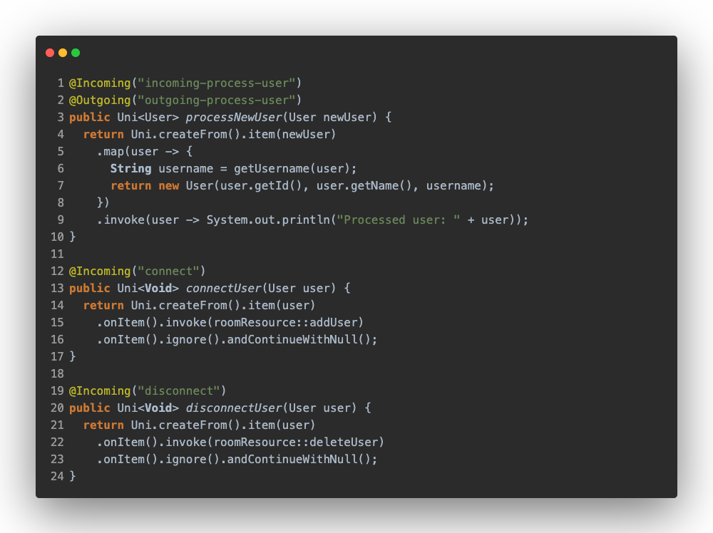
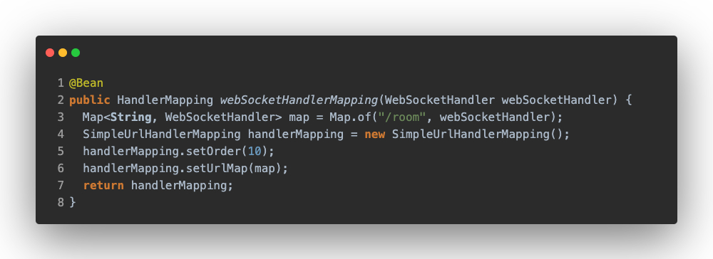
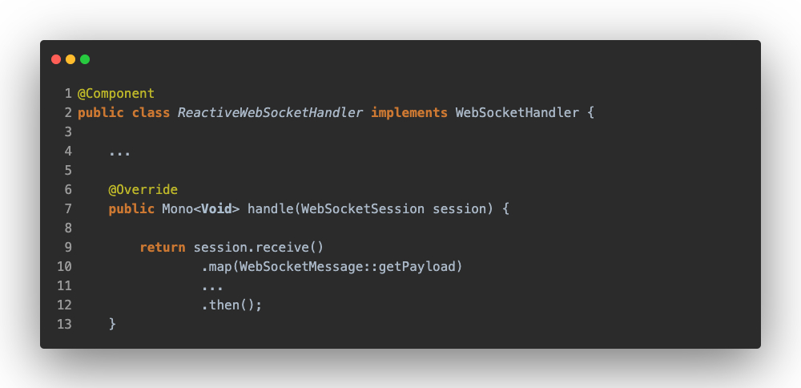

# Reactive WebSockets

In this section, we will look at how different the implementations are between Quarkus and Spring.

## Quarkus

Quarkus changes the imperative approach, now it's totally different from its imperative side, making use of the [Smallrye Reactive Messaging](https://smallrye.io/smallrye-reactive-messaging/smallrye-reactive-messaging/3.13/index.html) library, making use of [Reactive Streams](https://www.reactive-streams.org/).

### Server Side

A big difference is in the _application.properties_, where indicating the input/output direction of the data and assigning a name to the channel. Inside this channel is defined the property.

```properties
mp.messaging.incoming.[channel-name].[property]=value

mp.messaging.outgoing.[channel-name].[property]=value
```

Then, in the code, you have to implement the methods that will handle the incoming and outgoing data flow.



### Client Side

In this case, we have to configure two websockets connections because in the server side we don't have variable routes, and to detect when a client closes the connection it's necessary to send the event by this second WebSocket.

## Spring

From the Reactive side, Spring does not support [STOMP](https://stomp.github.io/stomp-specification-1.2.html#Abstract) and [SockJS](https://github.com/sockjs/sockjs-client) nor [SockJS](https://github.com/sockjs/sockjs-client) as it does on the imperative side. This already makes it less easy to switch from imperative to reactive, both at the conceptual level and at the implementation level.

Now, an _UrlHandlerMapping_ has to be configured, indicating which endpoint the WebSocket will connect to.



And to handle the events produced by the client, you must extend the _WebSocketHandler_ class which will override the session handling.



## Conclusion

Both Quarkus and Spring don't offer a solution similar to the imperative implementation, this makes neither of the frameworks easy to migrate from the imperative side, but it makes more sense to use Spring as it seems more flexible.

On the Quarkus side, in some ways it's simpler and more elegant, but seeing that it isn't very flexible as it isn't able to have variable paths. It is necessary to evaluate for which cases to use it and which not. In this example, this is a case where it isn't good to use it. A positive thing is that this approach is the same as with Reactive AMQP, so if you have previously understood how it works, it will be easier to understand.

In the Spring case, it handles route handling easily and you only have to add the desired behaviour afterwards. Also, it isn't necessary to create two WebSockets, when the client closes the connection the Server side detects this event and it can be handled as desired.