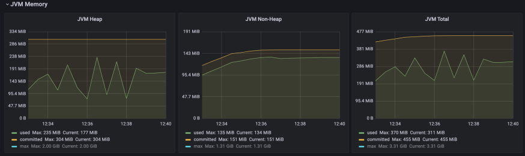

# Analysis Spring vs Quarkus Imperative
If you want to see all the details about load test data and JVM metrics can be found [here](https://github.com/MasterCloudApps-Projects/QuarkusMutiny_vs_ReactorSpring/tree/main/lab/imperative/metrics/macbook-pro-8gb).

## HTTP Performance
These are the results obtained using Artillery tool to load the application.

<table>
<thead>
  <tr>
    <th></th>
    <th colspan="2">SPRING</th>
    <th colspan="2">QUARKUS</th>
  </tr>
</thead>
<tbody>
  <tr>
    <td></td>
    <td>T1</td>
    <td>T2</td>
    <td>T1</td>
    <td>T2</td>
  </tr>
  <tr>
    <td>Request made</td>
    <td>60607 (100%)</td>
    <td>60750 (100%)</td>
    <td>60736 (100%)</td>
    <td>60736 (100%)</td>
  </tr>
  <tr>
    <td>Request completed</td>
    <td>5844 (9,64%)</td>
    <td>6892 (11,34%)</td>
    <td>60736 (100%)</td>
    <td>60736 (100%)</td>
  </tr>
  <tr>
    <td>Request failed</td>
    <td>54763 (90,36%)</td>
    <td>53858 (88,66%)</td>
    <td>0 (0%)</td>
    <td>0 (0%)</td>
  </tr>
  <tr>
    <td>Max req/seg</td>
    <td>78</td>
    <td>79</td>
    <td>359</td>
    <td>362</td>
  </tr>
</tbody>
</table>

If we look at the table and see the number of successful requests between the two frameworks there is a huge difference. Incredibly Spring is between 9,64% and 11,34% of successful requests, while Quarkus reaches 100%.

Regarding the amount of maximum supported requests between the two also huge, Spring(1) isn't able to reach 100 concurrent req/sec, however Quarkus reaches almost 360 concurrent req/sec. This is 4 times higher than Spring.

<table>
<thead>
  <tr>
    <th></th>
    <th colspan="2">SPRING</th>
    <th colspan="2">QUARKUS</th>
  </tr>
</thead>
<tbody>
  <tr>
    <td></td>
    <td>T1</td>
    <td>T2</td>
    <td>T1</td>
    <td>T2</td>
  </tr>
  <tr>
    <td>Median Response Time (ms)</td>
    <td>23,8</td>
    <td>21,1</td>
    <td>4</td>
    <td>4/td>
  </tr>
  <tr>
    <td>p95 Response Time (ms)</td>
    <td>308</td>
    <td>262,5</td>
    <td>34,1</td>
    <td>40</td>
  </tr>
  <tr>
    <td>p99 Response Time (ms)</td>
    <td>450,4</td>
    <td>441,5</td>
    <td>106,7</td>
    <td>115,6</td>
  </tr>
</tbody>
</table>

On the time of requests completed by both, Quarkus gives better response times, being 2.5 times faster if we set p95 as a more realistic measure. In any case, Quarkus response times are much better. This table show the number of times better response time of Quarkus over Spring.

|        	| Number of times better response time of Quarkus over Spring 	|
|--------	|:------------------------------------------------------------	|
| Median 	|                                                         5,61 	|
| p95    	|                                                         7,80 	|
| p99    	|                                                         4,02 	|

(1) To be more specific, the problem lies in Hikari's connection management.

## JVM metrics
At this point, we can see that the total percentage of heap/non-heap usage is quite similar, being slightly better on the Quarkus side. If we compare the CPU usage they are almost identical, but considering that the Spring application broke at the beginning of the test and wasn't able to report its metrics, we can't take that measurement for good, we believe it would be higher as that 14.53% only reflects when the application was stable without much load.

_Spring CPU Usage_

_Quarkus CPU Usage_

About the amount of MB used by the JVM heap/non-heap and JVM total, we can deduce that Quarkus consumes is better than Spring.

_Spring JVM_

_Quarkus JVM_

And if we look at the metaspace memory in this case, Quarkus is consuming more resources than Spring.

_Spring JVM Metaspace_

_Quarkus JVM Metaspace_

We can also observe that there is also a difference in the number of classes between both, where Quarkus is loading a slightly large amount of classes than Spring.

Finally, the number of live threads and although both reach 31 threads, but we do not know how the threads behave, in comparison, Spring remains more stable until it reaches a point where the application can no longer run.

_Spring Threads_

_Quarkus Threads_

# Conclusion
For some reason, with the default configuration of the Spring application it has problems with database connection management (at least on this machine), causing it to break much earlier than expected, and therefore the concurrent request data isn't very reliable.

Still, if we only look at response times and JVM resources, Quarkus general perform is better than Spring, which speaks very well for Quarkus, as it isn't such a mature framework.

In addition, these tests have been tested with the Quarkus's Fat Jar, if the tests had been done with a Quarkus native image, the data would possibly be better.
