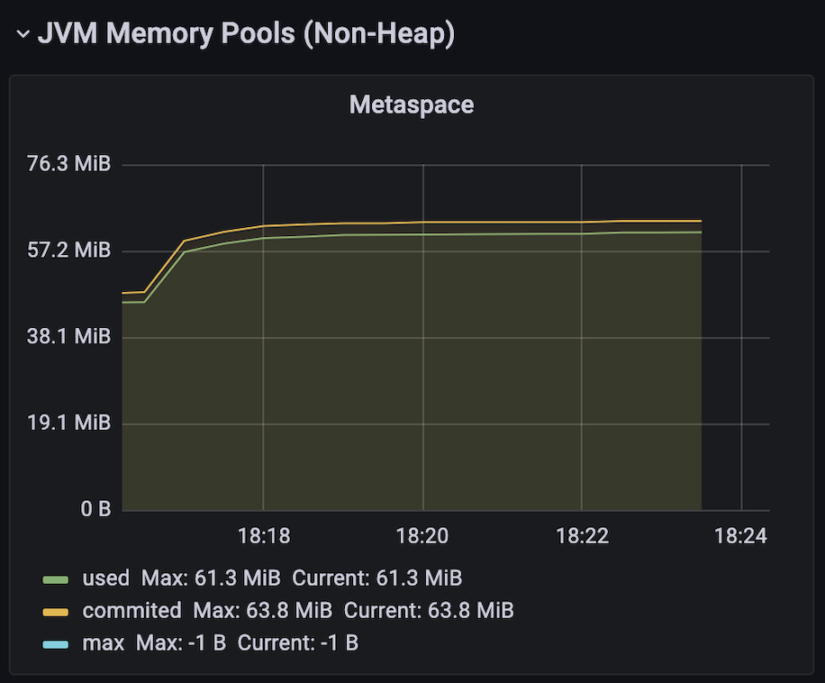
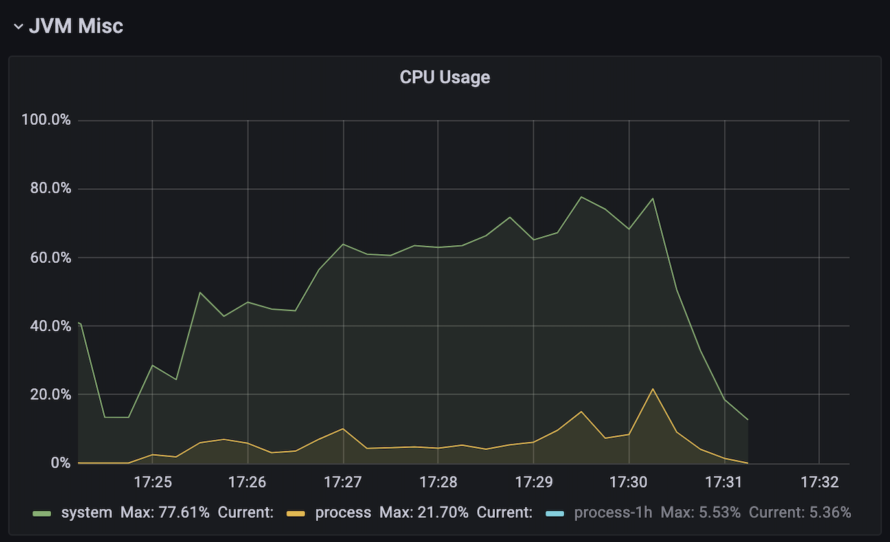

# Analysis Spring vs Quarkus Reactive
If you want to see all the details about load test data and JVM metrics can be found [here](https://github.com/MasterCloudApps-Projects/QuarkusMutiny_vs_ReactorSpring/tree/main/lab/reactive/metrics/macbook-pro-16gb).

## HTTP Performance
These are the results obtained using Artillery tool to load the application.

<table>
<thead>
  <tr>
    <th></th>
    <th colspan="2">SPRING</th>
    <th colspan="2">QUARKUS</th>
  </tr>
</thead>
<tbody>
  <tr>
    <td></td>
    <td>T1</td>
    <td>T2</td>
    <td>T1</td>
    <td>T2</td>
  </tr>
  <tr>
    <td>Request made</td>
    <td>60619 (100%)</td>
    <td>60632 (100%)</td>
    <td>60755 (100%)</td>
    <td>60741 (100%)</td>
  </tr>
  <tr>
    <td>Request completed</td>
    <td>52401 (86,44%)</td>
    <td>51584 (85,08%)</td>
    <td>30704 (50,54%)</td>
    <td>32923 (54,20%)</td>
  </tr>
  <tr>
    <td>Request failed</td>
    <td>8218 (13,56%)</td>
    <td>9048 (14,92%)</td>
    <td>30051 (49,46%)</td>
    <td>27818 (45,80%)</td>
  </tr>
  <tr>
    <td>Max req/seg</td>
    <td>352</td>
    <td>365</td>
    <td>543</td>
    <td>527</td>
  </tr>
</tbody>
</table>

If we start looking at the number of maximum concurrent requests, we see that Quarkus reaches 527 req/sec vs Spring's 365 req/sec, that is 43% more than Spring, but we see that Spring has 85% of successful requests compared to ~52% for Quarkus, this is something that contrasts because it's pointless to receive many more requests if the maximum of concurrent requests successfully completed is around 260 req/sec, which translates to 30% less than Spring.

<table>
<thead>
  <tr>
    <th></th>
    <th colspan="2">SPRING</th>
    <th colspan="2">QUARKUS</th>
  </tr>
</thead>
<tbody>
  <tr>
    <td></td>
    <td>T1</td>
    <td>T2</td>
    <td>T1</td>
    <td>T2</td>
  </tr>
  <tr>
    <td>Median Response Time (ms)</td>
    <td>7</td>
    <td>7</td>
    <td>7</td>
    <td>8,9</td>
  </tr>
  <tr>
    <td>p95 Response Time (ms)</td>
    <td>96,6</td>
    <td>92,8</td>
    <td>100,5</td>
    <td>115,5</td>
  </tr>
  <tr>
    <td>p99 Response Time (ms)</td>
    <td>169</td>
    <td>162,4</td>
    <td>169</td>
    <td>159,2</td>
  </tr>
</tbody>
</table>

As for the response time of each, they are practically the same, and although Quarkus's p95 times are a little lower than Spring's, they can't be described as worse, because on a day-to-day basis you wouldn't realize any difference. Similarly, if we look at the median or p99, Quarkus doesn't have an advantage over Spring.

|        	| Number of times better response time of Quarkus over Spring 	|
|--------	|:------------------------------------------------------------	|
| Median 	|                                                         0,11 	|
| p95    	|                                                        -0,88 	|
| p99    	|                                                         1,01 	|

## JVM metrics
If we start with the percentage of heap consumed, Quarkus is more than twice as high, but the percentage of non-heap is a bit lower than Spring. However, if we analyse in more detail the graphs of the JVM memory consumed, we can see that the heap JVM and the total JVM of Quarkus is relatively lower during the time it's able to manage the requests, when it starts to give errors is where these values increase to almost double the values of Spring.

_Spring JVM_

_Quarkus JVM_

Going to the JVM non-heap memory, Spring consumes about 20MB more memory, which coincidentally translates to 20% more memory than Quarkus. This fact goes This fact goes along with the amount of JVM memory consumed in the metaspace, where Quarkus consumes 12% less in this part.

_Spring JVM Metaspace_

_Quarkus JVM Metaspace_

In terms of CPU usage, the difference is less than 1%, so neither makes a difference.

_Spring CPU Usage_

_Quarkus CPU Usage_

The same happens with the threads, Spring starts with 16 and Quarkus with 11, although at the beginning of the load tests, Quarkus quickly increases the number to 17 threads.

_Spring Threads_

_Quarkus Threads_

Finally, the number of classes Spring loads is 20% higher compared to Quarkus.

# Conclusion
After analysing the data, if we start from the response times, both are practically equal, but they don't perform equally, Spring demonstrates its maturity, managing 30% more concurrent requests.

In terms of JVM resource management, Quarkus had a 20% less JVM consumption than Spring during the period when it was supporting the load, but after that, it was high without being able to provide service. Spring was more stable during the test and performed better than Quarkus.

In short, we are left with a bittersweet taste because Quarkus has had worse results due to not being able to manage the extra load, and not being a better alternative for cases that require a lot of stress.

