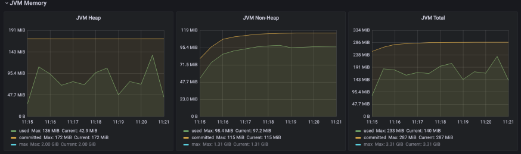
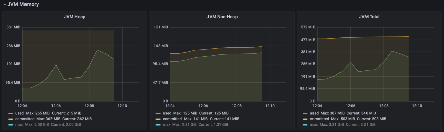
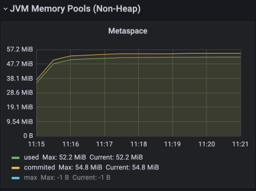
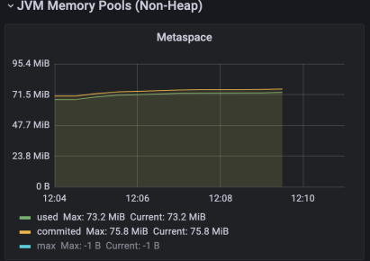
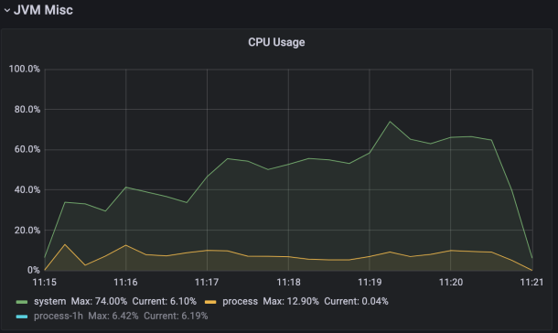
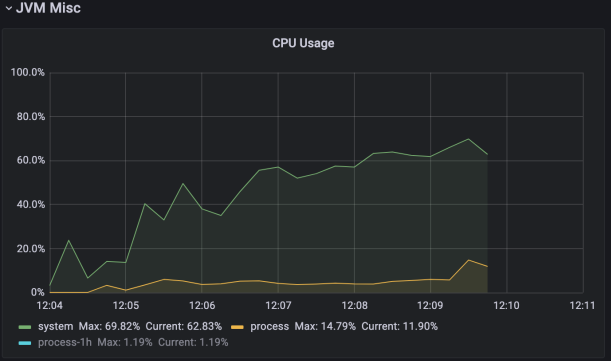
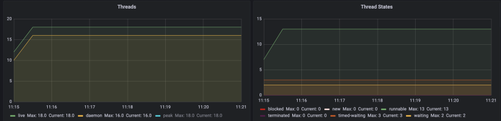
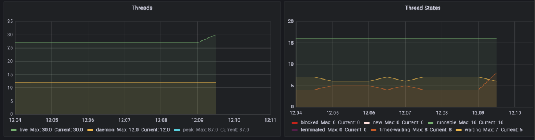

# Analysis Spring vs Quarkus Reactive
If you want to see all the details about load test data and JVM metrics can be found [here](https://github.com/MasterCloudApps-Projects/QuarkusMutiny_vs_ReactorSpring/tree/main/lab/reactive/metrics/macbook-pro-8gb).

## HTTP Performance
These are the results obtained using Artillery tool to load the application.

<table>
<thead>
  <tr>
    <th></th>
    <th colspan="2">SPRING</th>
    <th colspan="2">QUARKUS</th>
  </tr>
</thead>
<tbody>
  <tr>
    <td></td>
    <td>T1</td>
    <td>T2</td>
    <td>T1</td>
    <td>T2</td>
  </tr>
  <tr>
    <td>Request made</td>
    <td>60634 (100%)</td>
    <td>60734 (100%)</td>
    <td>60684 (100%)</td>
    <td>60752 (100%)</td>
  </tr>
  <tr>
    <td>Request completed</td>
    <td>60634 (86,44%)</td>
    <td>60734 (85,08%)</td>
    <td>41602 (68,56%)</td>
    <td>33999 (55,96%)</td>
  </tr>
  <tr>
    <td>Request failed</td>
    <td>0 (0%)</td>
    <td>0 (0%)</td>
    <td>19082 (31,44%)</td>
    <td>26753 (44,04%)</td>
  </tr>
  <tr>
    <td>Max req/seg</td>
    <td>355	</td>
    <td>362	</td>
    <td>360	</td>
    <td>363	</td>
  </tr>
</tbody>
</table>

If we start looking at the number of maximum concurrent requests, we see that Quarkus reaches 360 req/sec vs Spring's 355 req/sec, in this case, that is practically the same, but we see that Spring has 100% of successful requests compared to ~70% for Quarkus.

<table>
<thead>
  <tr>
    <th></th>
    <th colspan="2">SPRING</th>
    <th colspan="2">QUARKUS</th>
  </tr>
</thead>
<tbody>
  <tr>
    <td></td>
    <td>T1</td>
    <td>T2</td>
    <td>T1</td>
    <td>T2</td>
  </tr>
  <tr>
    <td>Median Response Time (ms)</td>
    <td>5</td>
    <td>4</td>
    <td>7,9</td>
    <td>7</td>
  </tr>
  <tr>
    <td>p95 Response Time (ms)</td>
    <td>80,6</td>
    <td>46.9</td>
    <td>90,9</td>
    <td>96,6</td>
  </tr>
  <tr>
    <td>p99 Response Time (ms)</td>
    <td>156</td>
    <td>100,5</td>
    <td>144</td>
    <td>147</td>
  </tr>
</tbody>
</table>

As for the response time of each, they are practically the same, and although Quarkus's p95 times are a little lower than Spring's, they can't be described as worse, because on a day-to-day basis you wouldn't realize any difference. Similarly, if we look at the median or p99, Quarkus doesn't have an advantage over Spring.

|        	| Number of times better response time of Quarkus over Spring 	|
|--------	|:------------------------------------------------------------	|
| Median 	|                                                         0,03 	|
| p95    	|                                                        -0,70 	|
| p99    	|                                                         0,88 	|

## JVM metrics
If we start with the percentage of heap consumed, Quarkus is more than twice as high, as well as the percentage of non-heap than Spring. However, if we analyse in more detail the graphs of the JVM memory consumed, we can see that the heap JVM and the total JVM of Quarkus is relatively lower during the time it's able to manage the requests, when it starts to give errors is where these values increase to almost double the values of Spring.

_Spring JVM_

_Quarkus JVM_

Going to the JVM non-heap memory, Quarkus consumes about 20MB more memory, which coincidentally translates to 20% more memory than Spring. This fact goes along with the amount of JVM memory consumed in the metaspace.

_Spring JVM Metaspace_

_Quarkus JVM Metaspace_

In terms of CPU usage, we can observe that current process numbers in Quarkus are higher than Spring ones.

_Spring CPU Usage_

_Quarkus CPU Usage_

About the threads, Spring starts with 16 and Quarkus with 27, although at the beginning of the load tests, Spring quickly increases the number to 17 threads.

_Spring Threads_

_Quarkus Threads_

Finally, the number of classes Spring loads is 20% higher compared to Quarkus.

# Conclusion
After analysing the data, if we start from the response times, both are practically equal, but they don't perform equally, Spring demonstrates its maturity, being able to manage more concurrent requests.

In terms of JVM resource management, Quarkus consume is higher than Spring during the period when it was supporting the load. Spring was more stable during the test and performed better than Quarkus.

In short, we are left with a bittersweet taste because Quarkus has had worse results due to not being able to manage the extra load, and not being a better alternative for cases that require a lot of stress.

